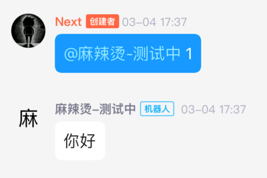
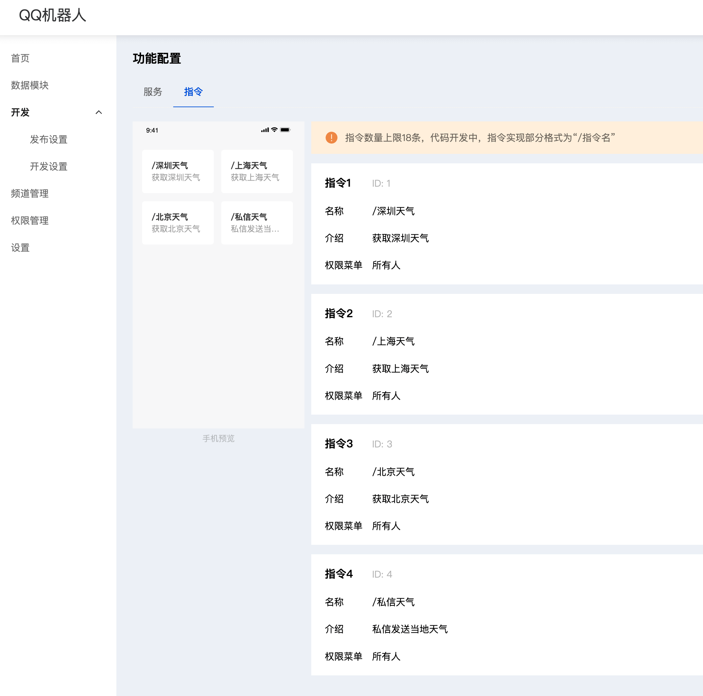
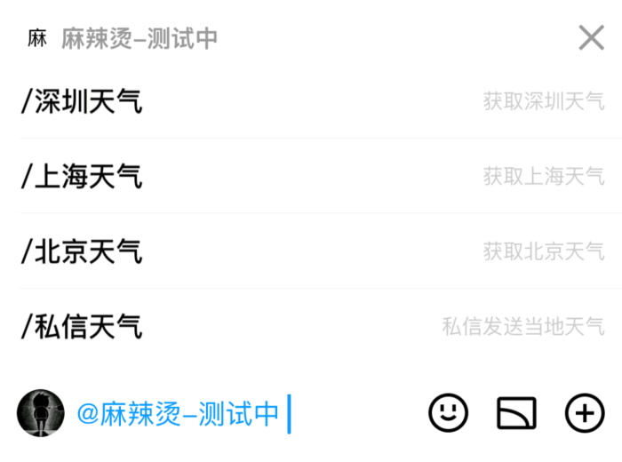
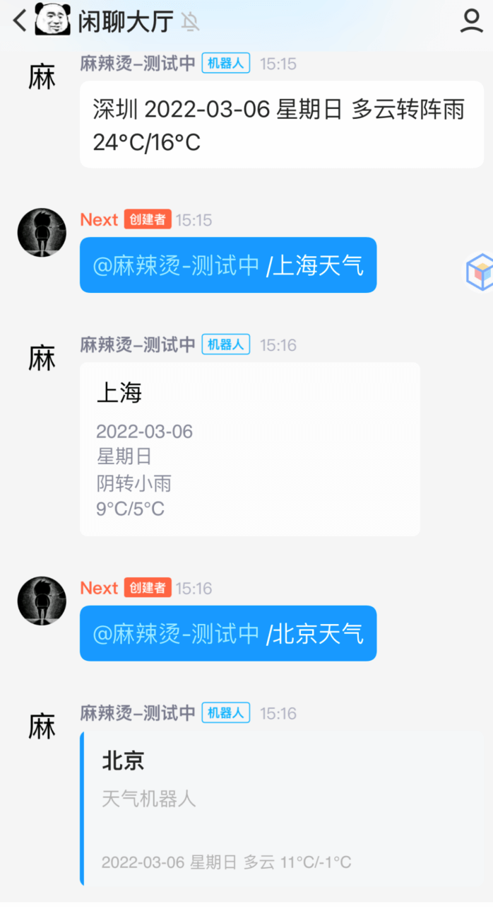

#天气机器人开发教程

## 开发前准备

参考 [申请机器人账号流程](https://bot.q.qq.com/wiki)

## 快速开始

- 安装 Node.js

从官网 http://nodejs.cn/ 下载安装 Node.js，建议安装12以上版本。如果你的电脑系统是 macOS，也可以使用 homebrew 安装

```
brew install node
````

查看 node 版本

```
node -v
```

- 安装 Yarn

Yarn 是替代 npm 的包管理工具，本教程使用 Yarn 安装依赖。

```
npm install --global yarn
```

- 创建项目

打开命令行工具，进入需要创建工程的目录，执行以下命令

``` typescript
mkdir weather-robot
cd weather-robot
yarn init -y
```

- 安装依赖

本项目使用了以下依赖包：qq-guild-bot（qq机器人 NodeSDK）、axios（网络请求库）、node-cron（定时器）、typescript、ts-node（执行typescript代码）、nodemon（代码改变时自动重启服务））、@types/node（node类型提示）@types/ws（websocket类型提示）、@types/node-cron

```
yarn add qq-guild-bot axios node-cron
yarn add -D typescript ts-node nodemon @types/node @types/ws @types/node-cron
```

- 测试机器人连接

在项目目录下新建文件夹src，在src下新建index.ts，内容如下（APPID和TOKEN要需要替换成自己的机器人，可以在 [机器人后台管理端](https://bot.q.qq.com/#/developer/developer-setting) 查看）

```
import { AvailableIntentsEventsEnum, createOpenAPI, createWebsocket, IMessage } from 'qq-guild-bot';

const botConfig = {
    appID: 'APPID', // 申请机器人时获取到的机器人 BotAppID
    token: 'TOKEN', // 申请机器人时获取到的机器人 BotToken
    intents: [AvailableIntentsEventsEnum.AT_MESSAGES], // 事件订阅,用于开启可接收的消息类型
    sandbox: false, // 沙箱支持，可选，默认false. v2.7.0+
};

// 创建 client
const client = createOpenAPI(botConfig);
// 创建 websocket 连接
const ws = createWebsocket(botConfig);

ws.on(AvailableIntentsEventsEnum.AT_MESSAGES, (data: { msg: IMessage }) => {
    console.log('[AT_MESSAGES] 事件接收 :', data);
    client.messageApi.postMessage(data.msg.channel_id, { content: '你好' }).then((res) => {
        console.log(res.data);
    }).catch((err) => {
        console.log(err);
    });
});
```

修改 package.json，添加 scripts 字段

```
{
  "name": "weather-robot",
  "version": "1.0.0",
  "main": "./src/index.ts",
  "author": "Next",
  "license": "MIT",
  "scripts": {
    "dev": "npx nodemon ./src/index.ts"
  },
  "dependencies": {
    "axios": "^0.26.0",
    "qq-guild-bot": "^2.8.2"
  },
  "devDependencies": {
    "@types/node": "^17.0.21",
    "@types/ws": "^8.5.2",
    "nodemon": "^2.0.15",
    "ts-node": "^10.6.0",
    "typescript": "^4.6.2"
  }
}
```

命令行启动服务

```
yarn dev
```

在频道内@机器人任意内容，收到机器人回复“你好”代表连接成功



## 常用 API 封装

机器人主要是用来处理用户消息，所以可以把常用消息接口进行封装，在 src 目录下新建 robot.ts

```
import { createOpenAPI, createWebsocket, IMessage, IOpenAPI, MessageToCreate, AvailableIntentsEventsEnum, GetWsParam, Embed, DirectMessageToCreate } from 'qq-guild-bot';
import { EventEmitter } from 'ws';

export class Robot {

    client: IOpenAPI;
    ws: EventEmitter;

    static createEmbedMessage(title: string, thumbnail: string, items: string[]) {
        const message: Embed = { title, thumbnail: { url: thumbnail }, fields: [] };
        items.forEach(item => {
            message.fields!.push({ name: item });
        });
        return message;
    }

    static createArk24Message(title: string, subtitle: string, desc: string, img?: string) {
        const message = {
            template_id: 24, kv: [
                { key: "#TITLE#", value: title },
                { key: "#SUBTITLE#", value: subtitle },
                { key: "#METADESC#", value: desc },
                { key: "#IMGC#", value: img },
            ]
        };
        return message as any;
    }

    constructor(config: GetWsParam) {
        this.client = createOpenAPI(config); // 创建 client
        this.ws = createWebsocket(config); // 创建 websocket 连接
        this.client
    }

    // 监听用户at机器人消息
    setAtMessagesHandler(handler: (message: IMessage) => void) {
        this.ws.on(AvailableIntentsEventsEnum.AT_MESSAGES, (data: any) => {
            console.log('[AT_MESSAGES] 事件接收 :', data);
            handler(data.msg);
        });
    }

    // 监听用户私信机器人消息
    setDirectMessagesHandler(handler: (message: IMessage) => void) {
        this.ws.on(AvailableIntentsEventsEnum.DIRECT_MESSAGE, (data: any) => {
            console.log('[DIRECT_MESSAGE] 事件接收 :', data);
            this.postDirectMessage(data.msg.guild_id, {
                content: '777',
                msg_id: data.msg.id,
            });
            handler(data.msg);
        });
    }

    // 给频道用户发送消息，message 中带 msg_id(回复用户的消息) 为被动消息，不带为主动消息会限制频率
    postMessage(channelID: string, message: MessageToCreate) {
        this.client.messageApi.postMessage(channelID, message).then((res) => {
            console.log(res.data);
        }).catch((err) => {
            console.log(err);
        });
    }

    // 给信息用户发消息
    postDirectMessage(guildID: string, message: MessageToCreate) {
        this.client.directMessageApi.postDirectMessage(guildID, message).then((res) => {
            console.log(res.data);
        }).catch((err) => {
            console.log(err);
        });
    }

    // 获取私信用户场景 id，与频道 id 不同，用于给频道中的用户发主动私信消息
    async getDirectMessageGuildID(sourceGuildID: string, authorID: string) {
        const result = await this.client.directMessageApi.createDirectMessage({ source_guild_id: sourceGuildID, recipient_id: authorID });
        return result.data.guild_id;
    }

}
```

有了封装好的 robo 后，监听用户 at 消息就可以写出下面这样

```
const robot = new Robot(botConfig);
robot.setAtMessagesHandler(message => {
  // 处理用户消息
});
```

开发天气机器人还需要有天气api，这里使用了 [NOWAPI](https://www.nowapi.com/api/weather.realtime)，详细使用方法可以阅读网站，这里对其进行封装，在 src 目录下心间 weather-service.ts

```
import axios from 'axios';

// https://www.nowapi.com/api/weather.realtime
const host = 'http://api.k780.com/';
const sign = 'b59bc3ef6191eb9f747dd4e83c99f2a4';  // 临时 sign，可能会失效
const appkey = '10003';

interface IWeatherData {
    days: string;                  // 2022-03-03
    week: string;                  // 星期四
    citynm: string;                // 深圳
    temperature: string;           // 25C/18C 
    temperature_curr: string;      // 24C
    humidity: string;              // 59%
    weather: string;               // 多云
    weather_curr: string;          // 晴
    weather_icon: string;          // 地址
    wind: string;                  // 东风
}

export class WeatherService {

    cityMap: { [key: string]: string } = {}; // 城市映射天气id { cityName: weatherId }

    constructor() {
        this.initCityMap();
    }

    initCityMap() {
        axios.get(host, {
            params: {
                app: 'weather.city',
                areaType: 'cn',
                appkey: appkey,
                sigƒn: sign,
                format: 'json',
            },
        }).then((response) => {
            const data = response.data;
            if (data.success === '1') {
                const list = data.result.dtList;
                Object.keys(list).forEach((key) => {
                    const item = list[key];
                    this.cityMap[item.cityNm] = item.weaId;
                });
            } else {
                console.error(data.msg);
            }
        }).catch((err) => {
            console.log(err);
        });
    }

    getWeatherID(city: string) {
        return this.cityMap[city];
    }

    getWeatherData(city: string) {
        return new Promise<IWeatherData>((resolve, reject) => {
            const weatherID = this.getWeatherID(city);
            if (!weatherID) {
                console.error('未找到weatherID');
            }
            axios.get(host, {
                params: {
                    app: 'weather.today',
                    weaId: weatherID,
                    appkey: appkey,
                    sign: sign,
                    format: 'json',
                },
            }).then((response) => {
                const data = response.data;
                if (data.success === '1') {
                    resolve(data.result);
                } else {
                    console.error(data.msg);
                    reject(data.msg);
                }
            }).catch((err) => {
                console.log(err);
                reject(err);
            });
        });
    }
}
```

## 实践

有了封装好的 robot.ts 和 weather-service.ts 后，我们就可以正式编写天气机器人逻辑了。

首先在 [机器人后台-开发-发布配置-功能配置页面](https://bot.q.qq.com/#/developer/publish-config/function-config) 配置几个快捷指令，分别为深圳天气、上海天气、北京天气、私信天气。



配置完成后点击机器人头像，或者@机器人时就会展示配置好的指令，这里需要说明的是指令只是帮助用户快捷输入消息，在服务端接受指令消息和普通消息是没有区别的。



为了演示，这里将各地天气通过不同的消息类型进行发送，消息模板可以参考 [文档](https://bot.q.qq.com/wiki/develop/api/openapi/message/message_template.html)。除了指令查询消息，还加入了一个主动推送天气的功能，用户在频道内@机器人输入订阅天气，机器人就可以每天早上8点在该订阅频道推送当日天气预告。完整代码如下 index.ts

```
import { AvailableIntentsEventsEnum } from 'qq-guild-bot';
import { Robot } from './robot';
import { WeatherService } from './weather-service';
import * as cron from 'node-cron';

const botConfig = {
    appID: process.env.ROBOT_ID as string, // 申请机器人时获取到的机器人 BotAppID
    token: process.env.ROBOT_TOKEN as string, // 申请机器人时获取到的机器人 BotToken
    intents: [AvailableIntentsEventsEnum.AT_MESSAGES, AvailableIntentsEventsEnum.DIRECT_MESSAGE], // 事件订阅,用于开启可接收的消息类型
    sandbox: false, // 沙箱支持，可选，默认false. v2.7.0+
};

const defaultCity = '深圳';
let subWeatherChannelID: string;

const weatherService = new WeatherService();
const robot = new Robot(botConfig);
robot.setAtMessagesHandler(message => {
    const content = message.content;
    if (content.includes('订阅天气')) { // 订阅天气
        subWeatherChannelID = message.channel_id;
        robot.postMessage(message.channel_id, {
            content: '订阅成功',
            msg_id: message.id,
        });
        return;
    }
    if (content.includes('/深圳天气')) { // 文字消息
        weatherService.getWeatherData('深圳').then(data => {
            robot.postMessage(message.channel_id, {
                content: `${data.citynm} ${data.days} ${data.week} ${data.weather} ${data.temperature}`,
                image: '',
            });
        });
        return;
    }
    if (content.includes('/上海天气')) { // embed 消息
        weatherService.getWeatherData('上海').then(data => {
            const replyMessage = Robot.createEmbedMessage(data.citynm, '', [data.days, data.week, data.weather, data.temperature]);
            robot.postMessage(message.channel_id, {
                embed: replyMessage
            });
        });
        return;
    }
    if (content.includes('/北京天气')) { // ark 消息
        weatherService.getWeatherData('北京').then(data => {
            const replyMessage = Robot.createArk24Message(data.citynm, `${data.days} ${data.week} ${data.weather} ${data.temperature}`, '天气机器人');
            robot.postMessage(message.channel_id, {
                ark: replyMessage
            });
        });
        return;
    }
    if (content.includes('/私信天气')) { // 私信消息，主动过私信会有每日限制次数
        robot.getDirectMessageGuildID(message.guild_id, message.author.id).then(guildID => {
            weatherService.getWeatherData(defaultCity).then(data => {
                robot.postDirectMessage(guildID, {
                    content: `${data.citynm} ${data.weather} ${data.temperature}`,
                });
            });
        });
        return;
    }
});

// 每天早上8点给订阅的频道发送天气预报
cron.schedule('0 0 8 * * *', () => {
    if (subWeatherChannelID) {
        weatherService.getWeatherData(defaultCity).then(data => {
            robot.postDirectMessage(subWeatherChannelID, { content: `${data.citynm} ${data.days} ${data.week} ${data.weather} ${data.temperature}` });
        });
    }
});
```

效果演示


